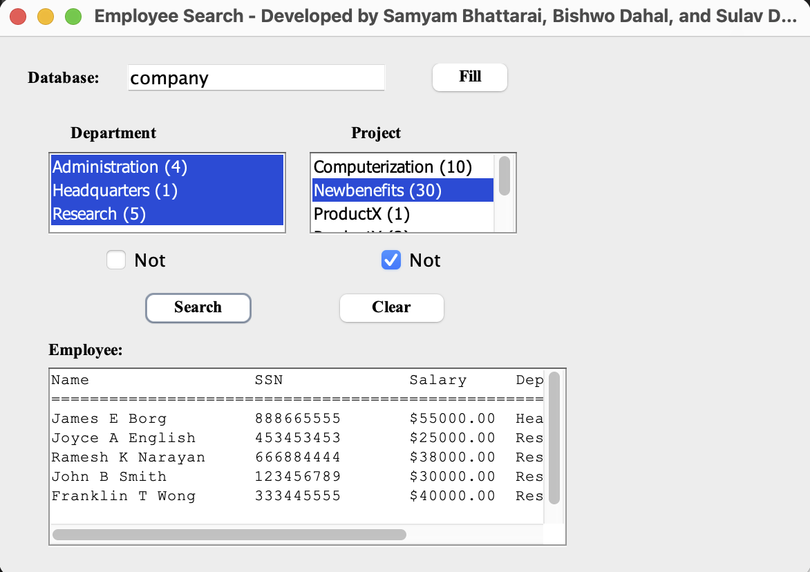

# database-broccoli
Project for CSCI 4055 class - Employee Database Search Application

## Demo

## Features
- Database connection to MySQL using JDBC
- Employee search with multiple filter criteria
- GUI interface using Java Swing

## Setup
1. Install MySQL server and JDBC driver
2. Update database credentials in `EmployeeSearchFrame.java`
3. Compile: `javac EmployeeSearchFrame.java` by passing connector jar file
4. Run: `java EmployeeSearchFrame` by passing connector jar file

## Contributors
- Bishwo Dahal
- Samyam Bhattarai
- Sulav Dhakal
